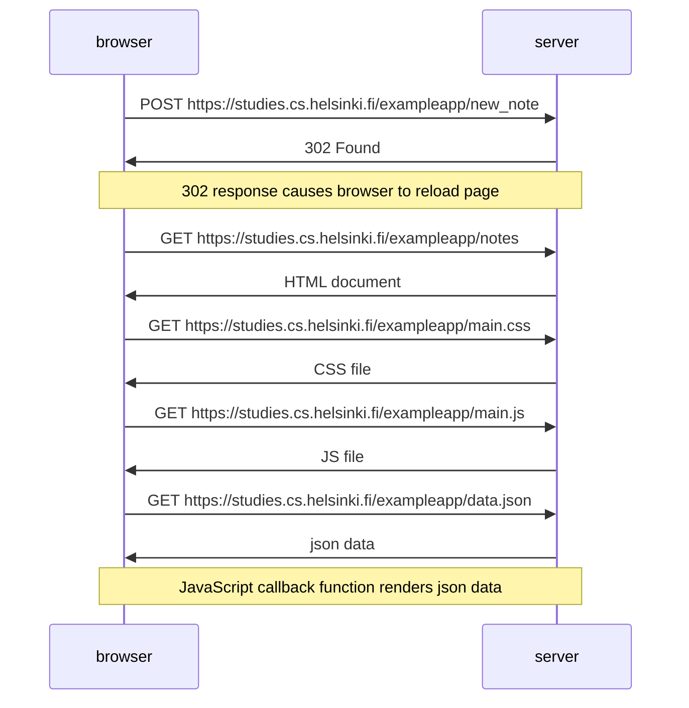

```mermaid
sequenceDiagram
    participant browser
    participant server
    browser->>server: POST https://studies.cs.helsinki.fi/exampleapp/new_note
    server->>browser: 302 Found
    Note over browser,server: 302 response causes browser to reload page
    browser->>server: GET https://studies.cs.helsinki.fi/exampleapp/notes
    server->>browser: HTML document
    browser->>server: GET https://studies.cs.helsinki.fi/exampleapp/main.css
    server->>browser: CSS file
    browser->>server: GET https://studies.cs.helsinki.fi/exampleapp/main.js
    server->>browser: JS file
    browser->>server: GET https://studies.cs.helsinki.fi/exampleapp/data.json
    server->>browser: json data
    Note over browser,server: JavaScript callback function renders json data
```
